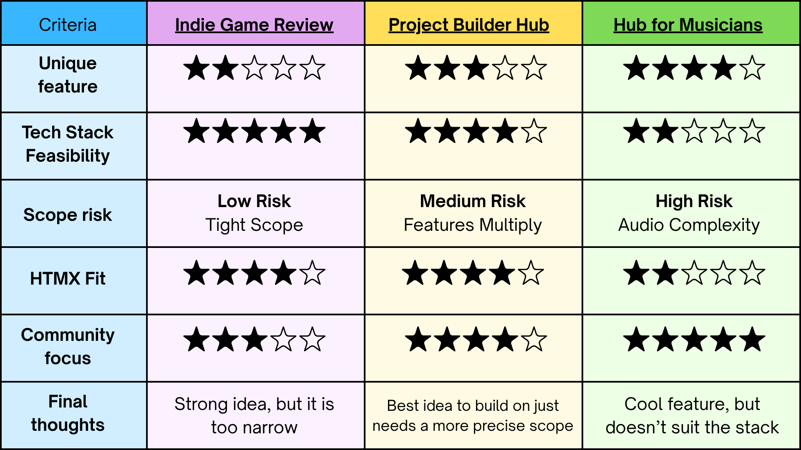

## Understanding the Brief
The brief challenges us to create an online community hub where members who have common interests can interact through our site and share their ideas. The brief states the hub should be responsive to both desktop and mobile but does not specify which one to prioritise. So when building our hub and understanding our community we should keep in mind where our users will mainly use our site and make our hub outstanding on that platform, whilst always keeping in mind the need for responsiveness. Since a signup system is already set in place, we can centralise our focus on the user's experience when navigating and using our hub. This means all the decisions we make should focus on maintaining the users attention rather than initially attracting them. The brief also set non-negotiable standards in place, which include AA accessibility standards, EU cookie consent and load times under three seconds. Since these are not optional but rather constraints it is important for our group to keep them in the forefront throughout the whole design process.

## Our Ideas
Once grasping the brief our group went straight to ideating and came up with three separate ideas to share with each other. I began with my interest in music and thought of why I would want an online community. As a drummer I always come across main problems; one, where I wish I could hear other instruments playing along with my beats and two, I find it difficult to share and have my music be discovered by others. So my initial idea to solve these struggles was to create a hub where musicians can upload something like a drum beat that other users can then layer their own section of music on top could be a cool idea. The hub would allow the community to listen to the different versions building up and then vote on which combination sounds the best, where the winning combination gets featured as the track of the week. Other interesting features could be some sort of genre/instrument tagging 
system so you can easily find collaborators who match your style, or a ‘looking for board’ where users could say “I have a beat, need a vocalist”. 

The other ideas my group came up with were an indie game review community where users describe indie games and the community rates their description. Once your rating averages 15+ points then you can unlock badges that allow you to give fuller, rich descriptions of games, indicating you are a credible source to find good games. 

They also came up with a project builder hub where people don’t just talk about ideas but they actually turn them into real projects through collaboration, structure and accountability. So this hub would be perfect for people with ideas but need help in actioning them.

## Choosing our Best Idea
Though we thought my idea was exciting and creative, through discussion I realised that with our current knowledge of coding and the tech stacks audio files would be very difficult for us to deal with, as it would eat up most of our time leaving us with little time to focus on the important features and making those successful. We also really liked the indie game review community but what turned us away from this idea was its main focus being reviews, we thought its need in today’s age is not evident enough for our hub to seem appealing and have a competitive advantage. Therefore the project builder ended up being the idea we are going to stick with and build upon as it is feasible within the techstack, we can all relate to it and have felt we would actually use this site ourselves.

