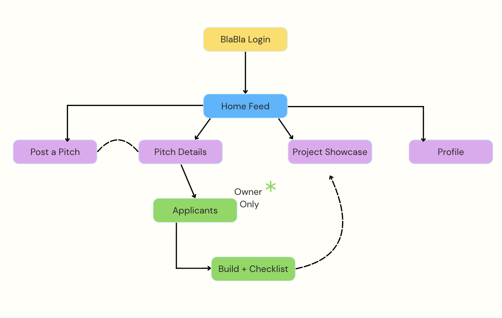
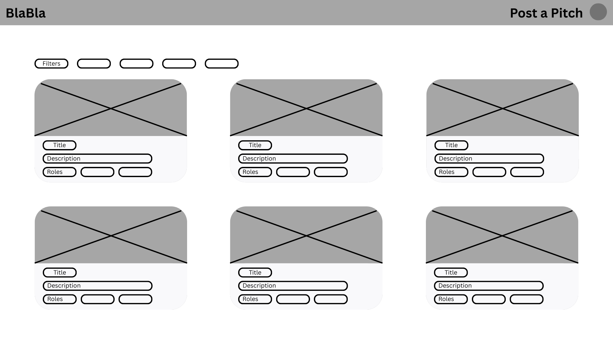

## Pages and Sitemap
Now that we have mapped out our requirements, we need to translate them into actual pages. We have landed on seven pages for our hub as we think that will be enough to cover the user journey without overcomplicating the concept given our timeframe. From a team perspective we thought it would be most practical to cap the hub at seven pages to allow each of us to take lead on two of the pages while coming together on the home feed. Structurally our pages fall into three zones. The home feed sits at the centre of everything, it is the page every user lands on after logging in and the point from which all other pages branch from. This then flows into the discovery pages (post a pitch, pitch details, showcase and profile) which are accessible to any logged in users. Sitting deeper in the structure are the project management pages (applicants and build checklist) that are conditionally accessible if you are locked into a project. The dashed arrow on our sitemap from build checklist to the showcase represents the final handoff where projects will flow to when they are complete. We chose this one-way flow deliberately to keep work separate from active pitches to maintain good usability and readability across the site.

## Wireframes
Our group each created our own set of wireframes separately before coming together to decide on our final layout. By doing this we can come up with a wide range of essential and unique features.

For the home/feed screen I chose to display the projects using cards as opposed to listing because I felt users would know this screen is interactable and in general the 3 card layout maintains that clarity our group is striving for, to ensure users can understand our hub and the information on it within seconds. I also included sliding tags above the projects as a way for users to enter in filters, so if they are looking for a specific type of project they want to work on it will be quick and easy to find it. 

For the layout with the Post a Pitch page I chose a wider layout so the user could see all the information on the page without necessarily needing to scroll, since the user will be actively inputting information this should make it a smoother process for them. A deliberate accessibility decision was to put the headings in separate boxes to where the users enter the information to make it clear what each input is asking for. I also decided to make the button to submit the pitch and centre it, so it subconsciously indicates to users this is the end point of the form and reduces their chance of missing it. 

In the build and checklist page I included the team profiles below the project title to immediately establish that this is a team space rather than a personal to-do list to reinforce the collaborative intent of the hub. The progress bar then sits directly below this to once again notify users the progress percentage is tied to the whole team. Each checklist row shows who has completed the task, this was done to add a light layer of accountability without having to firmly decide who will do what in the project.

After sharing our wireframes as a group we are deciding to follow Kashaypi’s wireframes as our base layout, whilst implementing elements from Aditi and I’s wireframes, as we think this will help us in having one shared direction. After designing our wireframes we know the information needed for each page, leading us to map out the core entities in our DDD.

