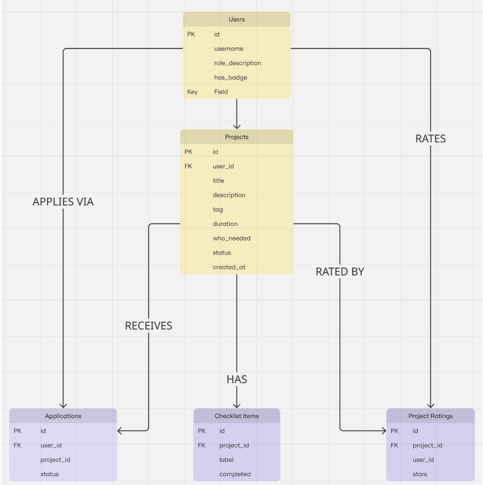

## MojoJS 

When a user visits the feed, MojoJS fetches all pitches from the database and renders them as cards. When a user then clicks on a specific pitch, MojoJs will look up the specific number of the pitch in the database and it firstly checks if someone is logged in based on session cookies and then compares their session user ID to the pitch creator's ID to know if they are the owner or a visitor. To fulfill one of our core requirements that certain pages are only available to some users MojoJS can also handle this through session cookies. Doing this with MojoJS rather than plain JavaScript will allow these rules to be firmly set in place and not risk users seeing pages they aren't supposed to.

## SQLite

After making our DDD we then made the ERD to understand the relationship of each entity, so when we use SQLite for our database we know that we need five tables that include Users, Projects, Applications, ChecklistItems and Ratings that each map to our user flow. A critical relationship we are aware of is between Projects and Applications, when the owner accepts an applicant their status updates from pending to accepted. So we need our system to check this in the database to decide whether a user can access the build checklist. We decided to take this approach instead of creating a whole other table for TeamMembers so it keeps the logic all in one place.

## HTMX

We know that HTMX lets us choose where live updates happen without having to reload the whole page, but we do want to be careful to not overuse it as it could just cause unnecessary complexity. So we thought the most important places we need to use HTMX will be to change the “Interested in” button to “Applied” instantly when the user clicks it. If we didn’t use HTMX for this and users were forced to reload to know whether the button worked would cause immense confusion and even risk users thinking the hub is not working as they may not know to reload the page. Another very important live feature we want is for the checklist progress bar to update in real time, if a reload was needed there could be issues in multiple members having their actions overridden because they tried to interact at the same time not knowing someone else has already completed a specific task. A less critical feature to be live but would be nice to have is real time updating of the star rating average to reinforce the sense that the showcase is an active community driven space.

## A trade-off we are considering

Originally we planned for every team member to confirm the completion of a project before it can be sent off to the showcase. Although we liked this method from a collaborative standpoint we have noticed there could be issues if a member goes inactive the project could be stuck in the building stage indefinitely, which could be very demotivating for other team members. So we are thinking of letting the owner say it is complete and ready to be sent off, but only once the checklist has completed. In terms of the database logic this will also make it significantly easier, as we won’t have to track the confirmation status of each team member. Despite this trade-off somewhat undercutting the collaborative nature we are aiming for, we think this will overall improve our user’s satisfaction and be more achievable for us as a team.

