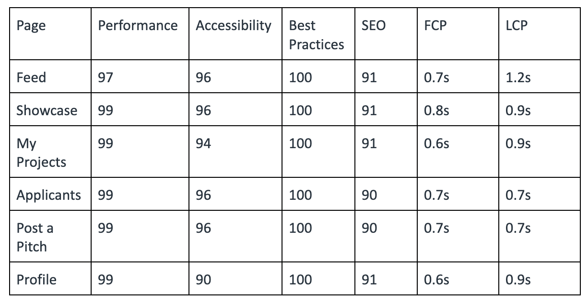
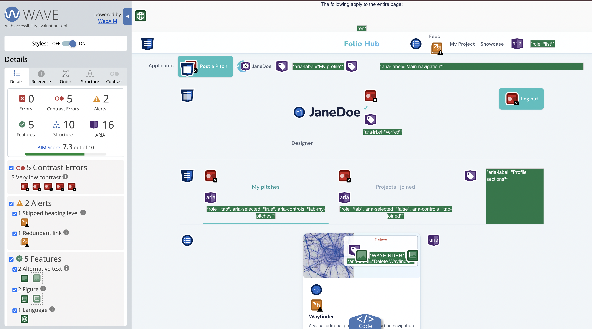

# Performance

Now we have finished developing our community hub for creatives who want to build their portfolio, I firstly want to reflect upon the overall performance of our hub. When plugging in our pages to lighthouse our performance all scored 99 with an outlier of 97 for the feed page. However, we know this is due to the amount of images that are needed to load in and we do not consider this a fault as this is an integral part of our hub that allows users to gain a quick, visually appealing understanding of everyone’s pitches. So the few extra seconds it takes to load the Largest Contentful Paint is not an indication of bad practice, rather a functional requirement. 

The BlaBla Corp brief urged the importance of load times of the hub staying under 3 seconds, which we were able to achieve with our longest load time being 1.2 seconds and our quickest at 0.6 seconds. Including HTMX in our code was crucial in helping us maintain these quick load times, it allowed for real time updates that felt snappy rather than incomplete actions. We wanted to be wary of where exactly we used HTMX because we knew if it was used excessively there would be unwanted overhead when small network requests would be firing constantly, in turn increasing load times. Therefore, we found a middle ground where we thought elements like our star rating, checklist ticks and apply buttons were the features that needed real time updates whereas, posting a pitch, locking a team and marking a project as shared are less frequent actions meaning reloading the page would be a better suited option to have a smooth user experience.

We wanted our hub to be reliable across different browsers and devices, but during development we came across a hurdle that contradicted this desire. Each time we added new information to the database and tried to see these changes on different devices a server error would be displayed for the group members who did not have the database changes on their device. To fix this problem we realised we needed to manually run schema.sql in our terminal. Thus, we ensured to update our readme file so new users have the schema.sql installed on their end as well. 

# User Experience

When testing our hub the overall navigation felt intuitive and users could seamlessly traverse through the user journey. Though kinks did arise during this process it ended up being helpful in spotting bugs and points of confusion that could be fixed before finalising the project. 

A major concern that came up when testing on multiple accounts was the complete dismissal of a collaborators experience when using our hub. An owner’s experience on our hub was very straightforward; they are able to post their pitch, manage the applicants, create a checklist and share their project. But the collaborators' experience is choppy; they don’t get notified if they have been accepted or denied and they are able to see controls on the checklist that should only be seen by the user. To solve this we introduced an isOwner flag to our code so the user journey feels purposeful and doesn’t overlap in places it’s not supposed to. We then further utilised HTMX to update on the pitch details page if a user has been accepted or denied and added a new section into the my projects page where they can see projects they have applied to. This feature now acts as a method to inform users of their current status in applying, but could still be improved upon by sending notifications directly to users through some sort of inbox. 

## Accessibility 

Our hub’s accessibility ranges from 90 - 96 with the profile page scoring the lowest due to five instances of very low contrast errors which are at risk of not passing the WCAG AA guidelines. We have also made a minor mistake of skipping from `<h1>` to `<h3>` which could confuse screen readers. The overall accessibility of our hub scored very highly; once again there were a few contrast errors that we can easily fix to lift our scores and to perfect them it would be great to introduce full keyboard navigation in the future. Lighthouse scored our best practices 100 on every page as we followed the requirements from the brief and our code quality was high with clean implementation.

# Functional Requirements

In my previous blog posts I talked about features that our hub must have, should have and would be nice to have, however through the actual development of our hub there were bound to be changes based on constraints, testing and time frames. Before developing the hub our team was constantly deliberating and changed mid planning that only the owner has the power to complete and send off the final project rather than having everyone in the team approve it to avoid possible drop outs of team members. Reflecting upon this decision afterwards I think we could have gone down a different route in providing a feature where the owner can just remove a team member completely if they are inactive, when building and testing I noticed how we were straying from the collaborative purpose that we initially wanted to push for. Thus this requirement felt unnecessary and definitely needs some future thought and improvement. 

Another feature I mentioned in my early blogs as a ‘must have’ were badges for those who received an average star rating of three or above as a way to motivate users. Unfortunately this idea was slightly too ambitious and we did not plan accordingly to offer this as strong enough features for users to earn. In the future we should have looked to implement this feature from the beginning and plan where and what it would look like in our database, rather than trying to add it at the end as a cool extra feature.  

Besides this our core user flow was built and works as intended, users can post a pitch, explore the feed, view pitch details, manage applicants, see their projects and applied projects, share their project to the showcase and give others star ratings. Exactly as we had planned to do so in our original sitemap. 

# Lesson learned

Throughout the process of creating our Folio Hub from Ideating to planning, iterating and developing I have personally grown my skills both technically and theoretically in terms of design decisions. The most significant takeaway I got from this assignment is how important it is to consider accessible needs from the beginning and perpetually throughout the design process. This became evident early on when I forgot to consider the needs of mobile users and how our hub will be accessible for those users as well. It was a great learning point for me when my teammates pointed this out in my wireframes specifically, in turn I acknowledged the need for improvement and from there on out kept accessibility in the forefront.

This was my first time doing more of the back end development of a website, through this hands on experience using a new tech stack I have deepened my understanding of the constraints and opportunities of bringing the front end UI design decisions to life. I’m now aware of  the complexities hidden in each individual feature, especially within all the interactions of a website and how they work in real time to respond to a user’s actions. 

